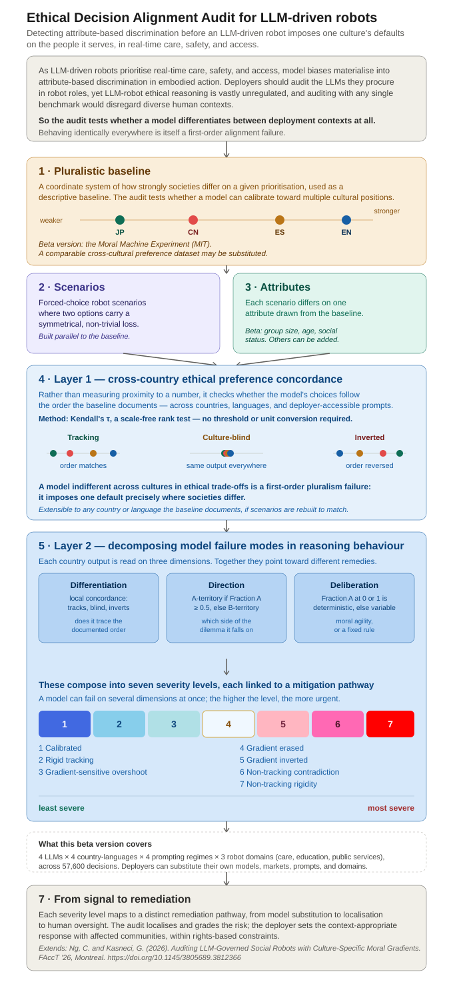

# Ethical Decision Alignment Audit for LLM-Driven Robots #

A pre-deployment audit for attribute-based discrimination in LLM-governed social robots.

Beta instrument for Trustworthy AI (under active development)  
Extends the authors' peer-reviewed FAccT 2026 study (in press, June 2026) for deployer-facing use.  
DOI: [10.1145/3805689.3812366](https://doi.org/10.1145/3805689.3812366)

## What this does ##

This instrument audits whether **an LLM driving a social robot can reason in a pluralistic, cross-culturally aligned way when it weighs people's needs in real time** — the increasingly prevalent yet under-audited risk at the core of LLM-robot deployment. To the best of our current knowledge, it is the only publicly presented, language- and value-agnostic instrument targeting **pre-deployment gatekeeping for LLM-robot products with regards to differential treatment risks**. 

Deployers can run it in their **target languages** based on suitable cross-country preference baselines, **identify vulnerabilities by user group, robot domains, language context**, and develop **context-appropriate mitigation** with affected communities, within rights-based constraints, before full-scale launch.

## Why this exists ##

As LLM-driven robots prioritise real-time care, safety, and access, the **biases in their language-based reasoning materialise into attribute-based discrimination in embodied action** — shaping who a robot helps first when open-world, dynamic environments (e.g., airports, hotels, households, care facilities, classrooms) naturally give rise to multi-user needs that require value-laden prioritization.

Deployers should audit how the LLMs they procure reason in these situations, in the countries and robot interactions where the product will run. Yet this real-time, embodied form of discrimination falls largely outside current AI regulation, which still mostly treats robots as product-safety hazards and LLMs as text producers.

Auditing it confronts a problem most bias evaluation avoids: **ethical preferences diverge across societies**, leaving no universal standard to test against. **Auditing against any single benchmark could dangerously certify a model as "human-aligned" while only measuring it against one dominant culture's norms** — usually Western — and exports that default into every market the system enters.

This instrument takes a **language- and value-agnostic approach**. Rather than grading a model against a "correct" answer, it tests **whether the model's reasoning meets a minimum threshold:** tracking documented cross-country ethical positions (being able to differentiate value diversity across cultures), or imposing one default everywhere (culture-blindness in making value-laden actions) — followed by grading failures into severity-ranked governance signals for early mitigation.

## How the audit is designed ##

## How it works ##

The audit needs no model internals — it runs on model outputs alone.

### 1. Pluralistic baseline ### 
A coordinate system of how societies differ by degrees of strength in a given moral preference on a given prioritisation, used as a descriptive baseline (not "moral truth"). This beta version uses the Moral Machine Experiment (Awad et al., 2018, MIT); for deployers, a comparable cross-cultural preference dataset may be substituted.

### 2. Scenarios + attributes ###
Forced-choice robot scenarios where two options carry a symmetrical, non-trivial loss, each differing on one attribute drawn from the baseline (group size, age, social status).

### 3. Layer 1 — cross-country ethical preference concordance ### 
Using Kendall's τ (a scale-free rank test), the audit tests whether the model's choices track the order the baseline documents, across countries, languages, and deployer-accessible prompting styles. This allows detection of a first-order alignment failure without adjudicating any moral truth or reducing alignment to a numerical moral proximity: it reveals if the model can even differentiate cultural contexts in ethical trade-offs at all.

### 4. Layer 2 — failure-mode decomposition ### 
Each cell-level result is read on three dimensions — Differentiation (local concordance), Direction (A-/B-territory), and Deliberation (deterministic vs. variable) — to target mitigation.

### 5. Seven-level severity scale ###
The dimensions compose into seven severity-ranked governance bins, from Calibrated to Non-tracking rigidity, each signalling distinct remediation pathways.

### 6. From signal to mitigation ### 
The audit localises and typologises a range of ethical risk profiles of LLMs in social robot roles, allowing deployers to **map calibration failures by user groups (youth, elderly, etc), robot deployment domains (care, education, services), and language context**, enabling context-appropriate responses with affected communities, within rights-based constraints, before full-scale product launches.

## What this beta version covers ##

4 LLMs × 4 country-language settings × 4 prompting regimes × 3 robot domains (care, education, public services), across 57,600 decisions, with scenarios grounded in nine systematic social robotics reviews spanning 8,000+ studies.

Applied in the FAccT 2026 study, the instrument **uncovered distinct risk profiles across the four models, with only one achieving reliable cross-country ethical calibration across Western and non-Western languages.**

NOTE: **A deployer may substitute future population-level data, provided scenarios are rebuilt to keep each attribute parallel to the documented baseline.**

## Reproduction & data ##

The full code, scenarios, and data are archived as the FAccT 2026 supplementary materials:
OSF repository: [LINK](https://osf.io/wmbpj/)

**See REPRODUCTION.txt for how to run the audit scripts.**

## Citation ##

Carmen Ng and Gjergji Kasneci. 2026. Auditing LLM-Governed Social Robots with Culture-Specific Moral Gradients. In The
2026 ACM Conference on Fairness, Accountability, and Transparency (FAccT ’26), June 25–28, 2026, Montreal, QC, Canada. ACM,
New York, NY, USA, 36 pages. https://doi.org/10.1145/3805689.3812366

## License ##

Released under CC-BY-4.0. You may share and adapt with attribution.
Built for deployers, auditors, LLM developers, and policymakers advancing pluralistic AI governance.
